# Instalación de Windows Server

A continuación se muestran imágenes orientativas del proceso de instalación de Windows Server y de la configuración básica inicial.

## Pasos generales

0. Configuracion de red en Oracle Virtualbox
1. Instalando Windows server.
2. Asignar nombre a equipo.
3. Configuración de IP.
4. Actualizaciones y firewall.

### 0 -   Configuración de Red en Oracle Virtualbox
El metodo de conexión "Conectar a" debe estar en modo Red interna

La red debe tener de nombre "redlab"

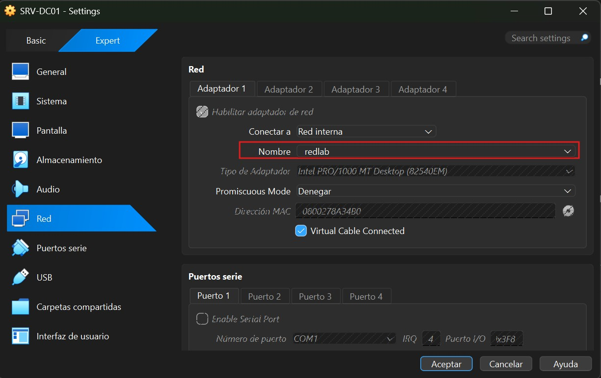

### 1 -  Instalación de Windows Server

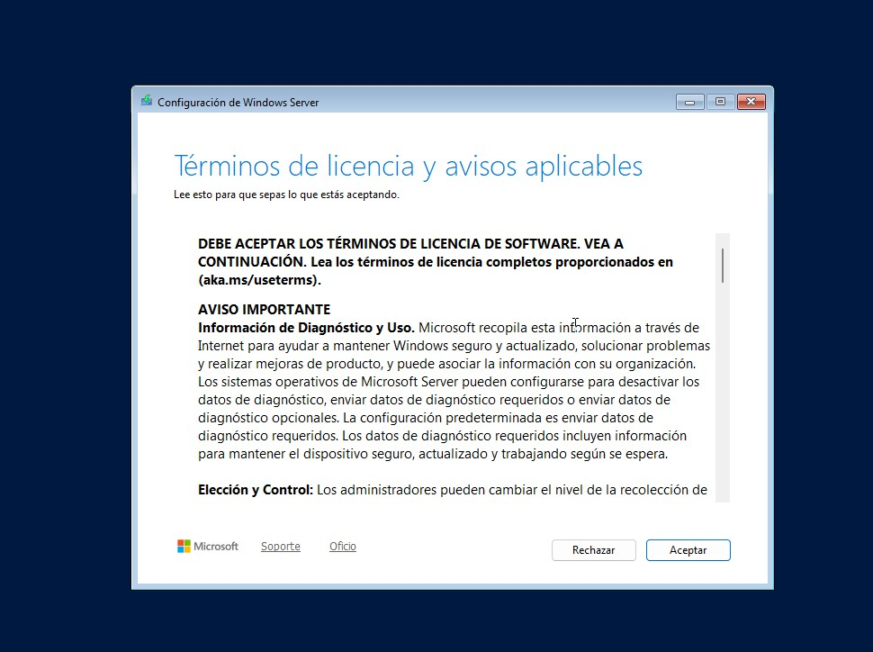

### Instalando

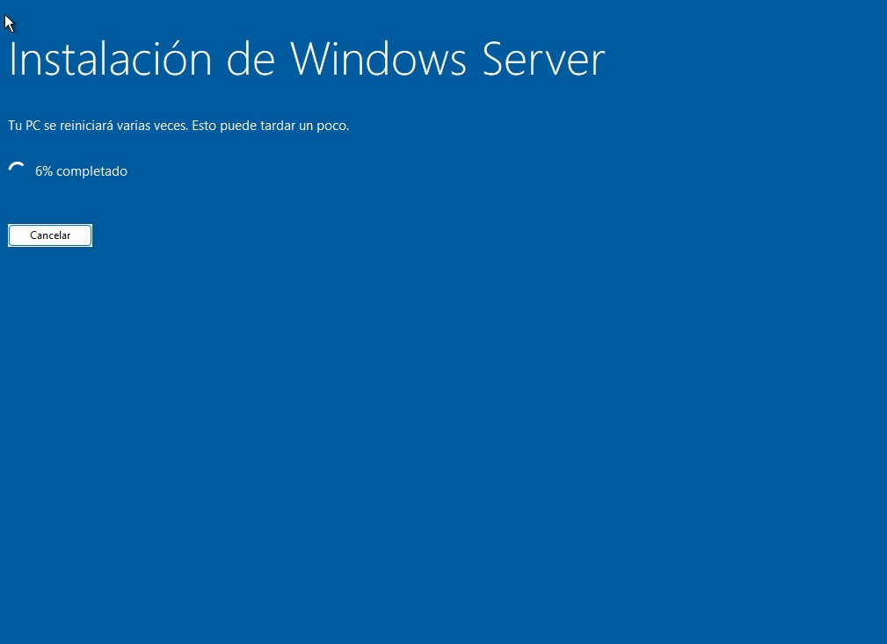

### 2 -  Cambiar nombre al equipo

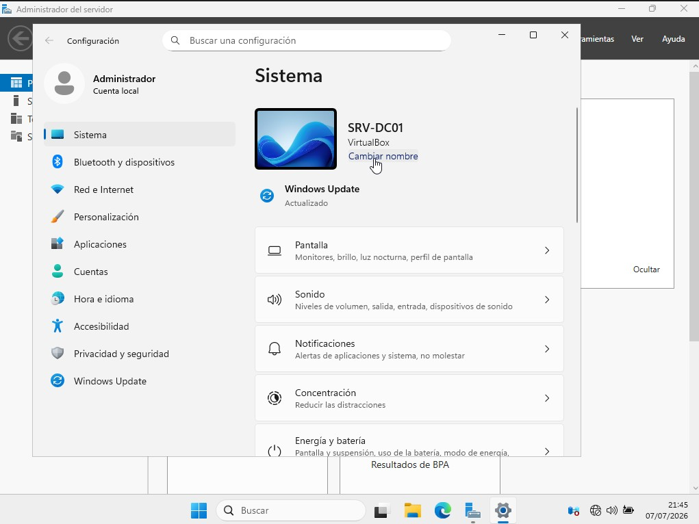

### 3 -  Configuración de IP

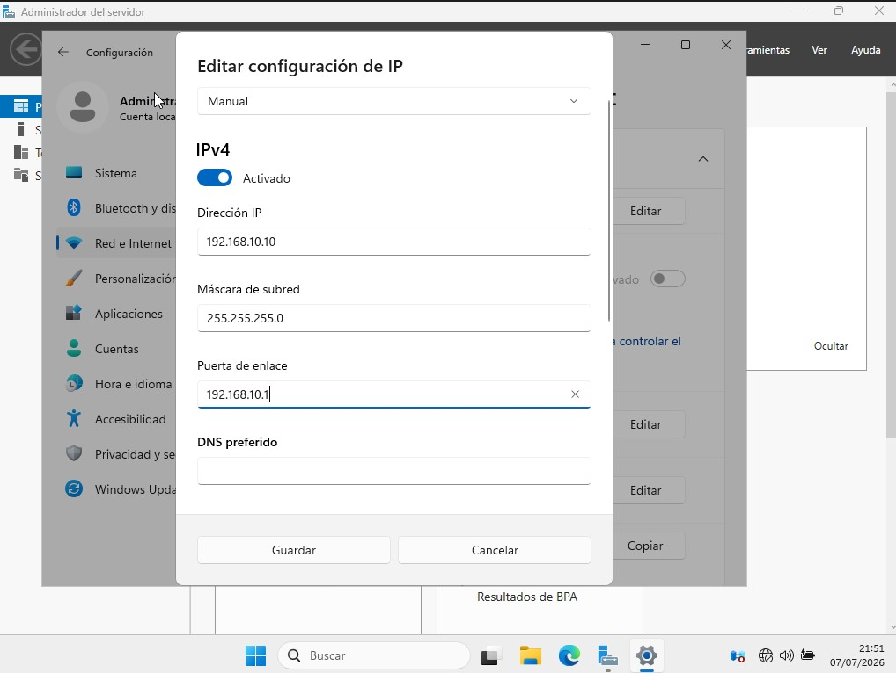
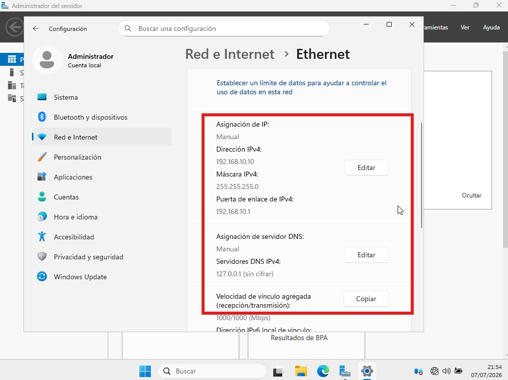

### 4 -  Actualizaciones y firewall

Se realiza una actualizacion preventiva para evitar posibles instrusiones ciberneticas al servidor, y se verifica el cortafuegos "firewall" que es el encargado de filtrar conexiones entrantes y salientes de la red dependiendo el requerimiento y el nivel de seguridad que se requiera aplicar al servidor. 

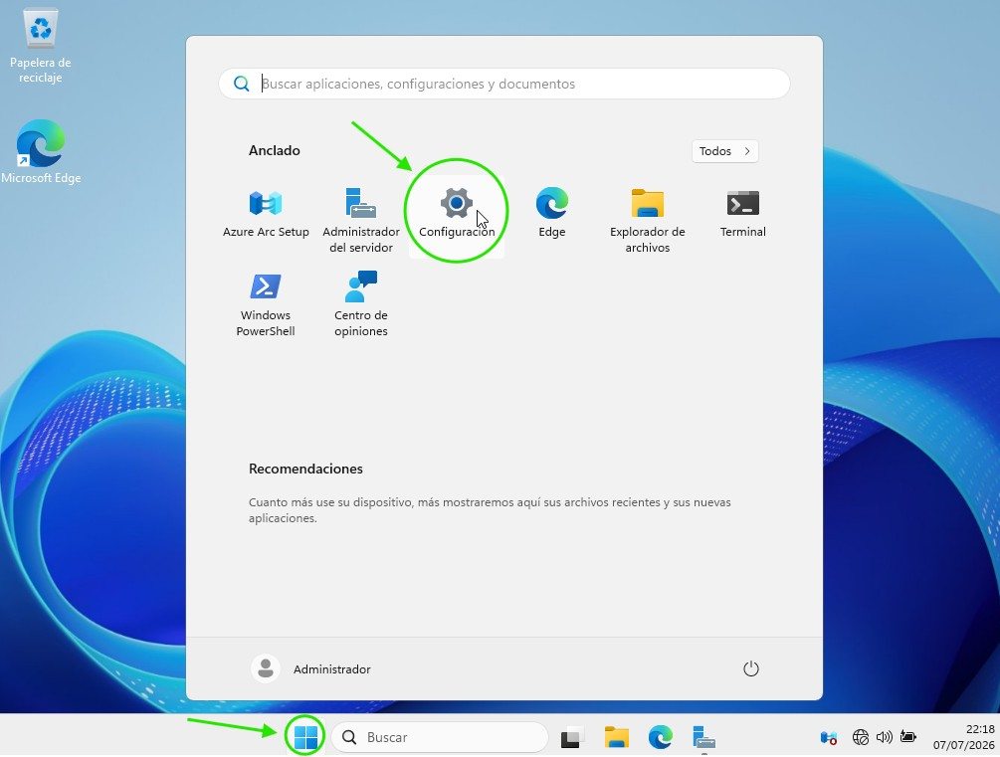
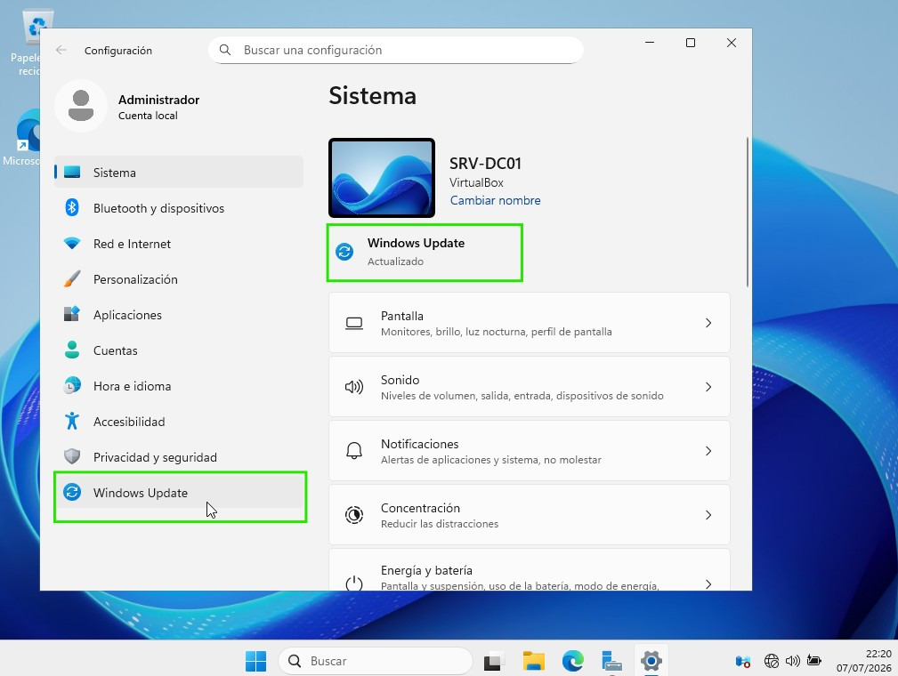
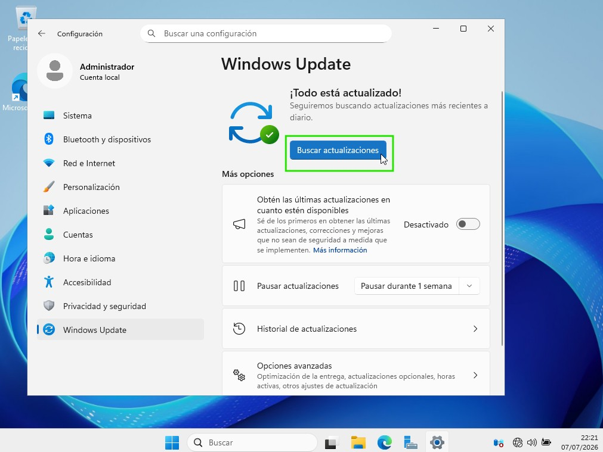

### 4 - Firewall

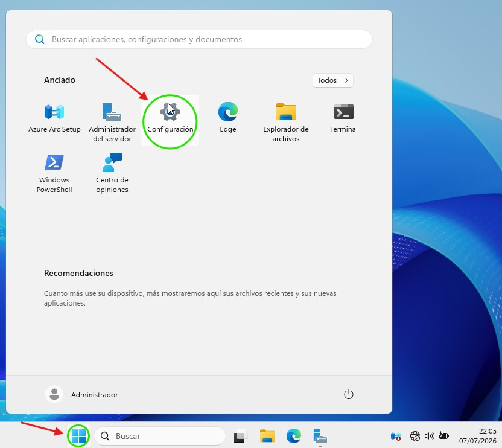
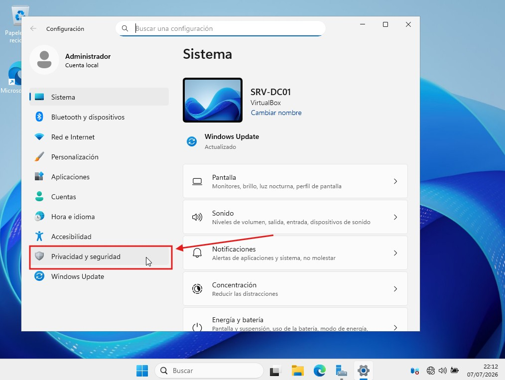
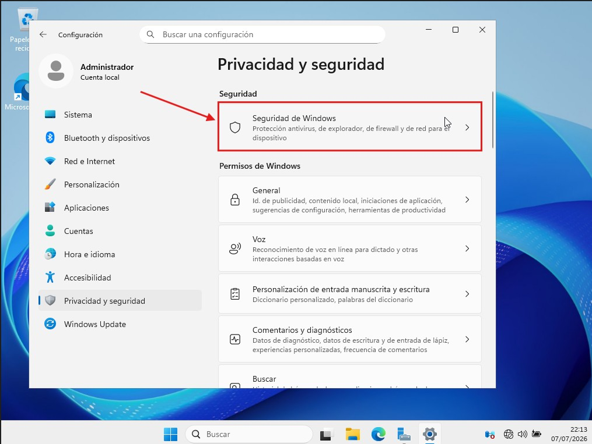
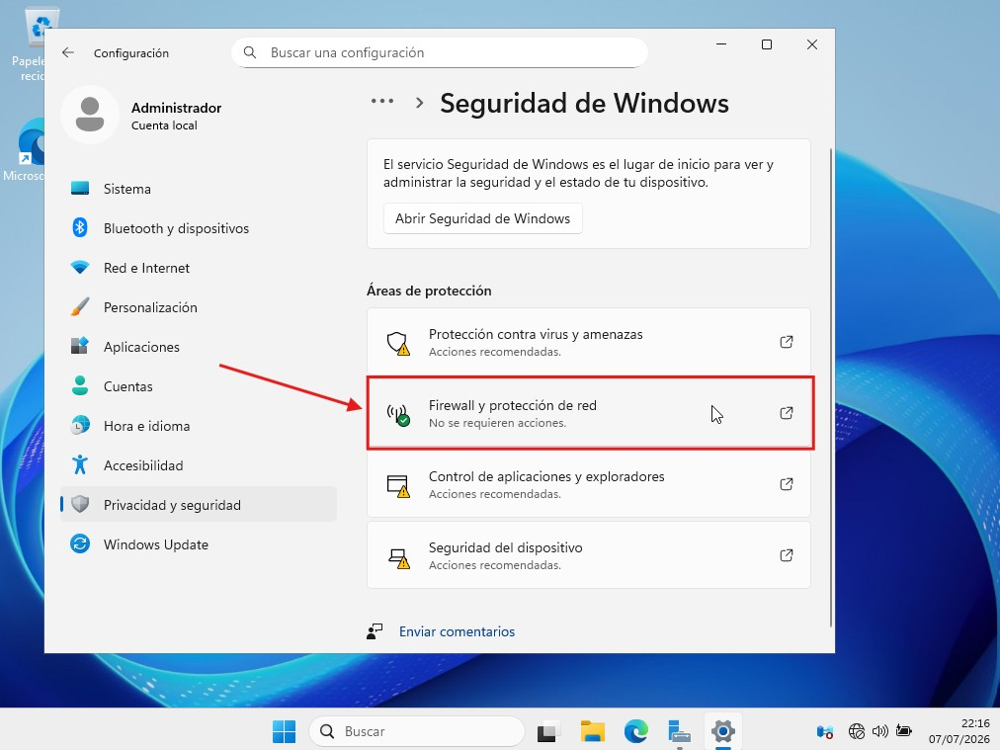
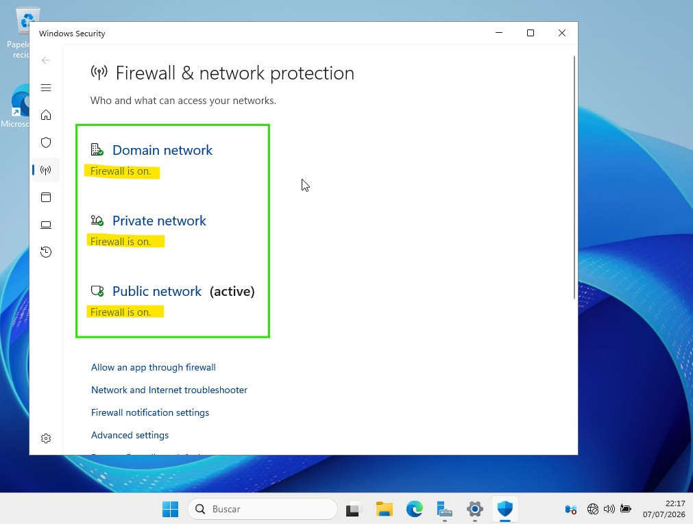